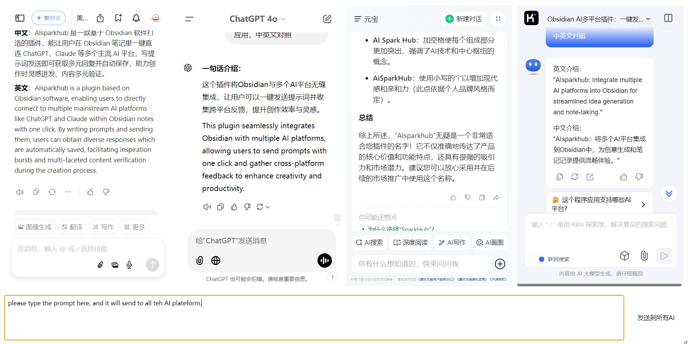

# Multi-AI Dialog Plugin for Obsidian

An Obsidian plugin that allows you to chat with multiple AI services simultaneously in a single window.

English | [简体中文](README_zh.md)

## Features

- 💬 Multi-AI Chat Interface: Chat with multiple AI services (like ChatGPT, Claude, Bard, etc.) simultaneously
- 🔄 Synchronized Input: Send the same message to all AI services with one click
- ⚡ Hotkey Support: Quick send messages using keyboard shortcuts (Ctrl+Enter)
- 🎨 Theme Compatible: Fully compatible with Obsidian's light and dark themes
- 📱 Responsive Design: Adjustable layout that works well on different screen sizes
- ✨ Customizable: Add, remove, or configure AI services through settings

## Installation

1. Open Obsidian Settings
2. Go to Community Plugins and disable Safe Mode
3. Click Browse and search for "Multi-AI Dialog"
4. Install the plugin
5. Enable the plugin in your Obsidian settings

## Usage

1. Click the robot icon in the left ribbon to open the Multi-AI Dialog window
2. Configure your AI services in the plugin settings:
   - Add URLs for the AI services you want to use
   - Configure selectors for each service (message input, send button, etc.)
3. Start chatting:
   - Type your message in the input box at the bottom
   - Press Ctrl+Enter or click the Send button to send to all AIs
   - View responses from all AIs simultaneously

## Configuration

The plugin can be configured through the settings tab:

- **Basic Settings**: Configure general plugin behavior
- **Frame Settings**: Add, remove, or modify AI service configurations
  - URL: The web address of the AI service
  - Selectors: CSS selectors for various elements (input box, send button, etc.)
  - Custom Settings: Additional settings specific to each AI service

## File Structure

- `main.js`: The main plugin file that contains the core functionality, including the plugin class, settings management, and UI rendering logic.
- `manifest.json`: Plugin manifest file containing metadata such as plugin ID, name, version, and minimum Obsidian version required.
- `styles.css`: Contains custom CSS styles for the plugin's UI elements and theme compatibility.
- `data.json`: Stores user configuration data and frame settings in a structured JSON format.
- `README.md`: Documentation file providing installation instructions, usage guidelines, and feature descriptions.

## Contributing

Contributions are welcome! Please feel free to submit a Pull Request.

## License

This project is licensed under the MIT License - see the LICENSE file for details.

## Support

If you encounter any issues or have suggestions, please open an issue on GitHub.

## Sponsor

If you find this plugin helpful, you can support me through:

## Acknowledgments

- Thanks to the Obsidian team for creating an amazing platform
- Thanks to all contributors who have helped improve this plugin
