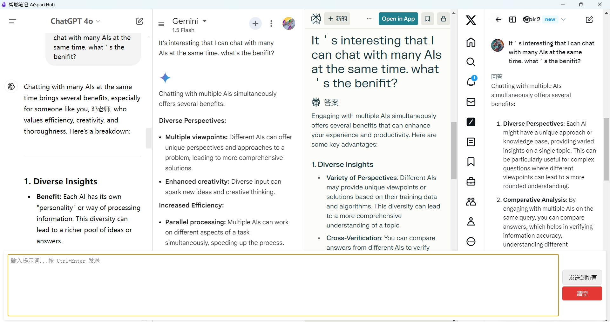

# AiSparkHub - 智燃笔记 Multi-AI Dialog Plugin for Obsidian

[English](#english) | [中文说明](#chinese)

---

## English

### Overview
AiSparkHub is a powerful Obsidian plugin that enhances your note-taking experience by integrating multiple AI platforms. It provides flexible ways to interact with AIs directly from your notes, allowing you to gather diverse insights and cross-validate ideas from different AI platforms simultaneously.

### Key Features
- **Multiple Input Methods**:
  - Send prompts directly from your notes using `Ctrl+Enter`
  - Use the floating prompt input box in the browser window
  - Input in the dedicated prompt area with larger space

- **Note Integration**:
  - Search and include note content in your prompts
  - Supports Obsidian's built-in search
  - Future support for smart connections and more RAG plugins
- **Multi-AI Support**: 
  - Chat with various AI platforms simultaneously (ChatGPT, Grok, Gemini, Perplexity, Doubao, Kimi, etc.)
  - Cross-validate ideas from different AI platforms
  - No API keys required - direct web interface integration

- **Flexible Workspace**:
  - Dual monitor support: Notes on one screen, AI responses on another
  - Single monitor: Seamless integration between notes and AI interfaces
  - Auto-hiding prompt input for clean workspace
- **Prompt Management**:
  - Automatic prompt history recording
  - Search and favorite prompts
  - Usage analytics with word clouds and trend charts
  - Future support for saving conversations to notes

### Installation
1. Open Obsidian Settings
2. Go to Community Plugins
3. Search for "AiSparkHub"
4. Click Install
5. Enable the plugin

### Usage Guide

#### Basic Operations
- **From Notes**: Type your prompt in any note and press `Ctrl+Enter` to send
- **From Browser**: Mouse over to show/hide the floating prompt input
- **Multi-AI View**: See responses from all enabled AI platforms simultaneously
- **Note Search**: Include relevant note content in your prompts

#### Workspace Setup
- **Dual Monitor**: 
  - Primary screen: Focus on note-taking
  - Secondary screen: View AI responses
- **Single Monitor**: 
  - Seamless switching between notes and AI responses
  - Floating prompt input for quick access

#### Advanced Features
- **Prompt History**: View, search, and reuse previous prompts
- **Analytics**: Track your AI usage patterns
- **Note Integration**: RAG support with built-in search

---

## 中文说明

### 概述
AiSparkHub 是一个强大的 Obsidian 插件，通过集成多个 AI 平台来增强您的笔记体验。它提供了多种方式直接从笔记中与 AI 交互，让您能够同时获取多个 AI 平台的见解，交叉验证想法。

### 主要功能
- **多种输入方式**：
  - 直接在笔记中输入问题，按 `Ctrl+Enter` 发送
  - 浏览器窗口中的悬浮提示词输入框
  - 更大空间的专用提示词区域
- **笔记集成**：
  - 搜索并引用笔记内容作为提示词
  - 支持 Obsidian 内置搜索
  - 未来支持智能连接等更多 RAG 插件
- **多AI支持**：
  - 同时与多个 AI 平台对话（支持 ChatGPT、Grok、Gemini、Perplexity、豆包、Kimi 等）
  - 交叉验证不同 AI 平台的想法
  - 无需 API - 直接网页界面集成
- **灵活工作空间**：
  - 双显示器支持：一个显示器专注笔记，另一个查看 AI 回复
  - 单显示器：笔记与 AI 界面无缝切换
  - 自动隐藏提示词输入框保持界面整洁
- **提示词管理**：
  - 自动记录提示词历史
  - 搜索和收藏提示词
  - 使用分析（词云和趋势图）
  - 未来支持将对话保存至笔记

### 安装方法
1. 打开 Obsidian 设置
2. 进入社区插件
3. 搜索 "AiSparkHub"
4. 点击安装
5. 启用插件

### 使用指南

#### 基本操作
- **笔记中使用**：在任何笔记中输入问题，按 `Ctrl+Enter` 发送
- **浏览器中使用**：鼠标划入显示/隐藏悬浮提示词输入框
- **多AI视图**：同时查看所有启用的 AI 平台的回复
- **笔记搜索**：在提示词中包含相关笔记内容

#### 工作空间设置
- **双显示器**：
  - 主屏：专注笔记工作
  - 副屏：查看 AI 回复
- **单显示器**：
  - 笔记与 AI 回复无缝切换
  - 悬浮提示词输入框快速访问

#### 高级功能
- **提示词历史**：查看、搜索和重用历史提示词
- **使用分析**：追踪 AI 使用模式
- **笔记集成**：支持内置搜索的 RAG 功能

---

## Changelog

### 1.0.0
- Initial release
- Multi-AI platform support
- Flexible prompt input methods
- Note integration features
- Prompt history and analytics
- Custom layout support

## Contributing

Contributions are welcome! Please feel free to submit a Pull Request.

## License

This project is licensed under the MIT License - see the LICENSE file for details.

## Support

If you encounter any issues or have suggestions, please open an issue on GitHub.

## Sponsor

If you find this plugin helpful, you can support me through:

## Acknowledgments

- Thanks to the Obsidian team for creating an amazing platform
- Thanks to all contributors who have helped improve this plugin
