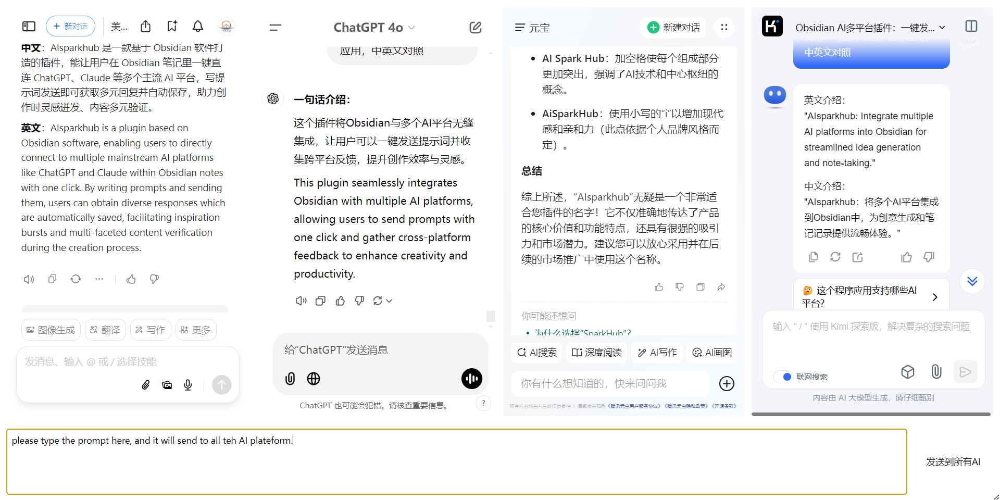

# Multi-AI Dialog Plugin for Obsidian

Obsidian的多AI对话插件，让您能在一个窗口中同时与多个AI服务对话。

[English](README.md) | 简体中文

## 特性

- 💬 多AI聊天界面：同时与多个AI服务（如ChatGPT、Claude、Bard等）对话
- 🔄 同步输入：一键将相同消息发送给所有AI服务
- ⚡ 快捷键支持：使用键盘快捷键（Ctrl+Enter）快速发送消息
- 🎨 主题兼容：完全兼容Obsidian的明暗主题
- 📱 响应式设计：自适应布局，适配不同屏幕尺寸
- ✨ 可定制化：通过设置添加、删除或配置AI服务

## 安装

1. 打开Obsidian设置
2. 转到社区插件并关闭安全模式
3. 点击浏览并搜索"Multi-AI Dialog"
4. 安装插件
5. 在Obsidian设置中启用插件

## 使用方法

1. 点击左侧边栏的机器人图标打开Multi-AI Dialog窗口
2. 在插件设置中配置您的AI服务：
   - 添加您想使用的AI服务的URL
   - 为每个服务配置选择器（消息输入框、发送按钮等）
3. 开始聊天：
   - 在底部输入框中输入您的消息
   - 按Ctrl+Enter或点击发送按钮发送给所有AI
   - 同时查看所有AI的回复

## 配置

插件可以通过设置标签页进行配置：

- **基本设置**：配置插件的一般行为
- **Frame设置**：添加、删除或修改AI服务配置
  - URL：AI服务的网址
  - 选择器：各种元素的CSS选择器（输入框、发送按钮等）
  - 自定义设置：特定于每个AI服务的其他设置

## 文件结构

- `main.js`：主插件文件，包含核心功能，包括插件类、设置管理和UI渲染逻辑
- `manifest.json`：插件清单文件，包含插件ID、名称、版本和所需的最低Obsidian版本等元数据
- `styles.css`：包含插件UI元素的自定义CSS样式和主题兼容性
- `data.json`：以结构化JSON格式存储用户配置数据和frame设置
- `README.md`：提供安装说明、使用指南和功能描述的文档文件

## 贡献

欢迎贡献！请随时提交Pull Request。

## 赞助

如果您觉得这个插件有帮助，可以通过以下方式支持我：

## 支持

如果您遇到任何问题或有建议，请在GitHub上开一个issue。

## 致谢

- 感谢Obsidian团队创造了这个令人惊叹的平台
- 感谢所有帮助改进这个插件的贡献者
